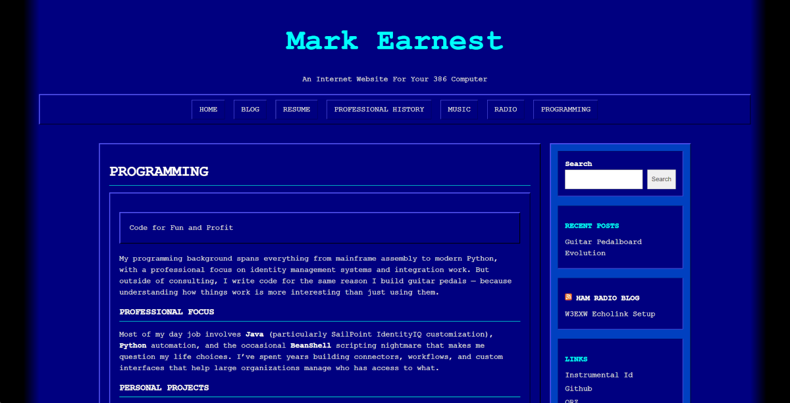

# Norton Simple

[](https://github.com/mark-iid/NortonUtilsWordpressTheme/actions/workflows/build.yml)
[](https://github.com/mark-iid/NortonUtilsWordpressTheme/releases/latest)
[](https://wordpress.org/)
[](https://www.php.net/)
[](./LICENSE)

A WordPress theme with a retro Norton Utilities / DirectoryMaster aesthetic. Dark blue background, cyan headers, monospace font throughout, and the beveled-border UI elements of classic DOS-era software.



Requires WordPress 6.6 or later and PHP 7.4 or later. Tested against
WordPress 7.1.

## Features

- Norton Utilities-inspired visual design (circa 1991)
- Responsive two-column layout (stacks to single column on mobile)
- Primary navigation with OS-style raised/pressed button borders, including
  drop-down submenus that open on hover or keyboard focus
- Norton Box, Norton Box Invert and Norton Alert blocks, plus matching
  shortcodes for classic-editor content
- `theme.json` palette and type scale, so the block editor offers the theme's
  colours and nothing else
- Matching block editor styles — what you write is what readers get
- Full template set: index, single, page, archive, search results, 404 and
  threaded comments, with paginated post listings and prev/next post navigation
- Widgetized right sidebar, featured images and wide/full block alignment
- Customizable footer status text via the WordPress Customizer
- CRT edge-fade effects via CSS pseudo-elements
- Translation ready, with a POT file in `languages/`

## Installation

**From a release (quickest):**

Download `norton-simple.zip` from the [latest release](https://github.com/mark-iid/NortonUtilsWordpressTheme/releases/latest)
and upload it via **WP Admin → Appearance → Themes → Add New → Upload Theme**.
Every tagged build is produced by the same script CI runs.

**From source:**

```bash
git clone https://github.com/mark-iid/NortonUtilsWordpressTheme.git
cd NortonUtilsWordpressTheme
npm install
npm run build
```

Then upload `dist/norton-simple.zip` the same way.

**Manual:**

Copy the theme folder directly to `wp-content/themes/norton-simple/` on your WordPress install and activate.

## Build

```bash
npm install       # install the single dev dependency (archiver)
npm run build     # → dist/norton-simple.zip
npm run clean     # remove dist/
```

The zip is self-contained — just the theme files, no dev artifacts.

The [Build theme](.github/workflows/build.yml) workflow runs the same build on
every push and pull request to `main`. Pushing a `v*` tag additionally checks
that the tag matches the `Version:` line in `style.css`, then attaches the zip
to a GitHub Release — so bump `style.css` and `package.json` before tagging.

## Blocks

Three blocks appear under the **Design** category in the inserter:

| Block | Effect |
|---|---|
| Norton Box | Raised bevel — content sits proud of the page |
| Norton Box Invert | Inset bevel — content sits recessed |
| Norton Alert | Status panel with an `[!]`, `[✓]` or `[✗]` glyph |

All three accept inner blocks, so anything can go inside them. They are
registered from `blocks/<name>/block.json` and rendered server-side by the
matching `render.php`, which means markup changes take effect on existing
posts without re-saving them.

## Shortcodes

For content written in the classic editor:

```
[norton_box]
Content displayed in a raised blue box.
[/norton_box]

[norton_alert]Generic alert with yellow [!] prefix[/norton_alert]
[norton_alert type="success"]Operation complete[/norton_alert]
[norton_alert type="error"]Operation failed[/norton_alert]
```

## Customizer Options

**Appearance → Customize → Footer**

| Setting | Default |
|---|---|
| Footer Status Text | `[SYS] OPERATIONAL` |

## File Structure

```
norton-simple/
├── theme.json                  Palette, type scale, spacing, layout
├── assets/
│   ├── css/
│   │   ├── norton-components.css  Tokens + box/alert/table chrome (shared with editor)
│   │   ├── norton.css             Front-end layout, header, nav, sidebar, footer
│   │   └── editor-style.css       Block editor canvas adjustments
│   └── js/
│       └── blocks.js           Editor-side block implementations
├── blocks/
│   ├── box/                    block.json + render.php
│   ├── box-invert/
│   └── alert/
├── inc/
│   ├── setup.php               Theme support, enqueue, sidebar, nav fallback
│   ├── customizer.php          Customizer controls
│   ├── shortcodes.php          [norton_box], [norton_box_invert], [norton_alert]
│   └── blocks.php              Block registration from block.json
├── languages/
│   └── norton-simple.pot       Translation template
├── template-parts/
│   ├── content.php             Generic post/archive content partial
│   ├── content-single.php      Single post full content
│   ├── content-page.php        Page full content
│   └── content-none.php        No results / 404 content
├── 404.php
├── archive.php
├── comments.php
├── search.php
├── footer.php
├── functions.php               Thin bootstrap — requires inc/ files
├── header.php
├── index.php
├── page.php
├── sidebar.php
├── single.php
├── style.css                   Theme header only (WordPress metadata)
├── build.js                    Build script
├── package.json
├── COPYRIGHT                   Theme copyright notice
└── LICENSE                     Verbatim GPL-3.0 text
```

## License

This theme is licensed under the **GNU General Public License v3.0 or later** (GPL-3.0-or-later).

[LICENSE](./LICENSE) is the verbatim GPL-3.0 text as published by the Free
Software Foundation; the theme's own copyright notice is in
[COPYRIGHT](./COPYRIGHT). Both ship inside the built zip, which is what the
GPL requires of anyone redistributing the theme. You are free to:
- Use this theme on any website
- Modify the code
- Distribute modified or unmodified versions

Under the condition that you:
- Include the original license and copyright notice
- Disclose the source code of any modifications
- Use the same license (GPL-3.0 or later) for any derivative works

For more information, visit https://www.gnu.org/licenses/gpl-3.0.html

## Styling

Colours, typography, spacing and the link/heading/button element styles are
declared in `theme.json`, and reach the browser as `--wp--preset--*` custom
properties. `assets/css/` styles only what `theme.json` has no field for:
layout, and the beveled chrome.

No stylesheet in the theme contains an `!important`. If a rule looks like it
needs one, the value almost certainly belongs in `theme.json` instead — that
is what makes the theme win the cascade without fighting it.
